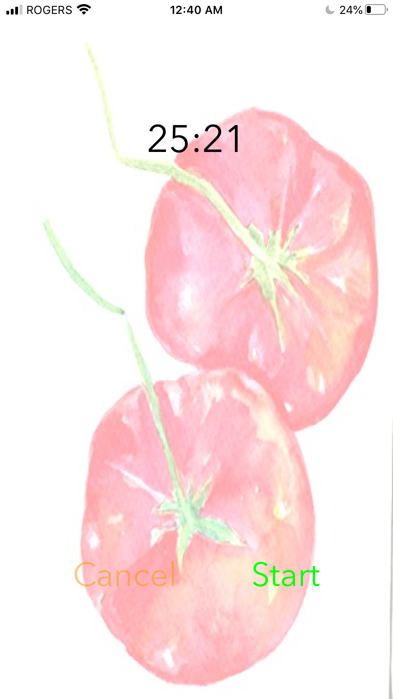
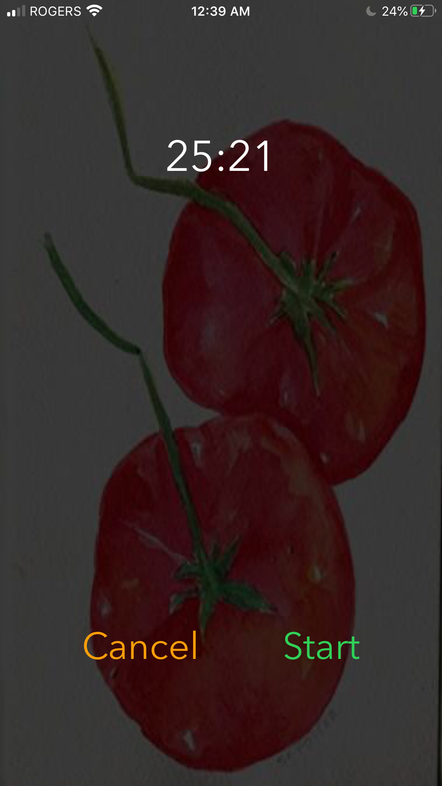
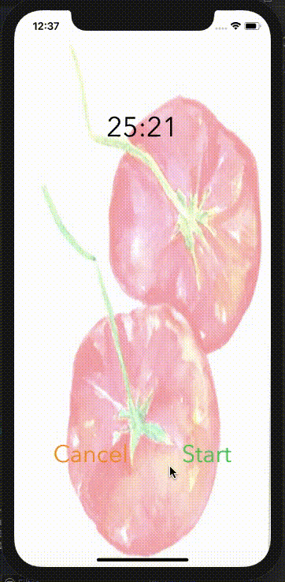

# PomoLofi IOS

A pomodoro app written in Swift that helps you practice pomodoro technique with your favourite lofi music.

Explore the usage of IOS application development, audio and timer library in Swift programming language.

## Features
- Start and Pause both the timer and music.
- When user click cancel, it will reset both the timer and music.

## Appearance 

### Light Mode

### Dark Mode

## Demostration

## Resources that I used

- [Here is the music used](https://www.youtube.com/watch?v=TcybwqWF5kE&t=2s)
- [Lighten JPG](https://pinetools.com/lighten-image)
- [Darken JPG](https://pinetools.com/darken-image)
- [Convert JPG to PDF](https://jpg2pdf.com/)
- [Photo Enlarger](https://www.photoenlarger.com/)
- [App Icon Generator](https://appicon.co/)